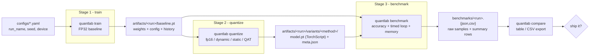
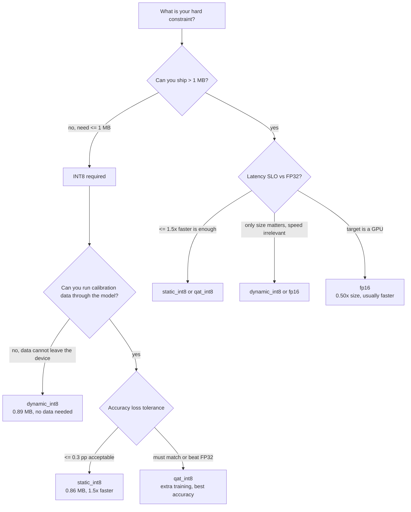

# QuantLab

[](https://www.python.org/)
[](https://pytorch.org/)
[](#tests)
[](LICENSE)
[](#gpu--accelerator-support)

QuantLab is an experiment runner that answers one question about a PyTorch model:
**what do I lose and what do I gain when I quantize it?**

It trains an FP32 baseline, derives four quantized variants of the *same* model, and measures
every one of them for accuracy, model size, parameter memory, latency distribution and
throughput. The output is a machine-readable JSON/CSV report plus a table you can paste into a
review.

```
                 size (MB)                          latency (mean, ms)
                 smaller is better ▸                faster is better ▸
fp32          ████████████████████ 3.30          █████░░░░░░░░░░░░░░░ 2.86
fp16          ██████████░░░░░░░░░░ 1.66          ████████████████████ 12.01
dynamic_int8  █████░░░░░░░░░░░░░░░ 0.89          █████░░░░░░░░░░░░░░░ 3.10
static_int8   █████░░░░░░░░░░░░░░░ 0.86          ███░░░░░░░░░░░░░░░░░ 1.87
qat_int8      █████░░░░░░░░░░░░░░░ 0.86          ███░░░░░░░░░░░░░░░░░ 1.87
```

That single picture is the whole point of the tool: a 3.8× smaller model that is also 1.5×
*faster* — or a "free" FP16 that is 4× *slower* on the same CPU. Both outcomes are surprising
until you measure them, which is why the tool measures instead of assuming.

---

## Contents

- [Why QuantLab](#why-quantlab)
- [What gets measured](#what-gets-measured)
- [How it works](#how-it-works)
- [Quickstart](#quickstart)
- [Concrete use cases](#concrete-use-cases)
- [Quantization methods](#quantization-methods)
- [Test report A — MNIST](#test-report-a--mnist)
- [Test report B — Fashion-MNIST](#test-report-b--fashion-mnist)
- [Test report C — GPU / accelerator](#test-report-c--gpu--accelerator)
- [Wall-clock cost of a full run](#wall-clock-cost-of-a-full-run)
- [GPU / accelerator support](#gpu--accelerator-support)
- [Benchmark methodology](#benchmark-methodology)
- [Results format](#results-format)
- [Configuration reference](#configuration-reference)
- [CLI reference](#cli-reference)
- [Which method should I pick?](#which-method-should-i-pick)
- [Extending QuantLab](#extending-quantlab)
- [Tests](#tests)
- [Repository layout](#repository-layout)
- [Limitations](#limitations)
- [Roadmap](#roadmap)
- [FAQ](#faq)
- [License](#license)

---

## Why QuantLab

Every quantization blog post claims the same three things: INT8 is 4× smaller, twice as fast,
and loses almost no accuracy. All three claims are conditional:

- The size claim is roughly true and easy to check.
- The speed claim depends on the hardware, the operator mix and the runtime — on this machine's
  CPU, dynamic INT8 is actually *slower* than FP32, and FP16 is 4.2× slower than FP32.
- The accuracy claim depends on calibration data and on whether you fine-tune.

QuantLab exists so those claims are replaced by numbers from *your* model, *your* data and
*your* target device, in under two minutes for a small CNN. It is deliberately not a training
framework, not a deployment tool and not a dashboard: no frontend, no cloud dependencies, no
abstractions beyond what the four CLI commands need.

## What gets measured

| Metric | What it means | How it is obtained |
| --- | --- | --- |
| Top-1 accuracy | on the full test set, same loader for every method | one evaluation pass before timing |
| Accuracy delta | method accuracy minus FP32 accuracy of the same run | computed per report |
| Parameter count | `Linear`/conv weights including packed quantized weights | `parameter_stats`, unpacking `_packed_params` |
| Parameter bytes | memory needed by weights alone, dtype-aware | `numel * element_size` |
| Serialized size | bytes actually written to disk for that artifact | in-memory save with the artifact format |
| Latency | mean, median, p95, p99, min, max, std over N timed runs | `perf_counter` + device synchronization |
| Throughput | samples / second at the configured batch size | `batch_size / mean_latency` |
| Memory | process peak RSS everywhere; peak device allocations on CUDA | `getrusage`, `torch.cuda.max_memory_allocated` |
| Status | `ok` or `failed` with the error string | failures never abort the run |

## How it works



Four commands, one directory of artifacts, one directory of results. Each stage is usable on
its own, so you can re-benchmark without re-training, or re-quantize with a different
granularity without re-benchmarking anything else.

## Quickstart

Requires Python 3.10+ and PyTorch 2.1+. Datasets (MNIST, Fashion-MNIST, CIFAR-10) are
downloaded on first use into `data/`.

```bash
git clone <repo-url> quantlab
cd quantlab
./scripts/setup.sh                 # creates .venv, installs quantlab in editable mode
source .venv/bin/activate

quantlab train     --config configs/mnist_cnn.yaml    # 1. FP32 baseline        (~35 s)
quantlab quantize  --config configs/mnist_cnn.yaml    # 2. four variants        (~17 s)
quantlab benchmark --config configs/mnist_cnn.yaml    # 3. measure everything   (~10 s)
quantlab compare   --results benchmarks/mnist_cnn.json
```

Real output of the last command on an Apple M5 (CPU only, 200 timed runs after 20 warm-up
runs, batch 64):

```
run: mnist_cnn  device: cpu  runs: 200 (warm-up 20)  batch: 64
method        status  acc     d_acc    params   size_mb  latency_ms  p95_ms  thr/s     size_ratio  speedup
------------  ------  ------  -------  -------  -------  ----------  ------  --------  ----------  -------
fp32          ok      0.9903  +0.0000  824,458  3.305    2.855       2.914   22,416.4  1.00x       1.00x
fp16          ok      0.9903  +0.0000  824,458  1.656    12.012      12.227  5,327.9   0.50x       0.24x
dynamic_int8  ok      0.9905  +0.0002  824,458  0.890    3.096       3.168   20,668.5  0.27x       0.92x
static_int8   ok      0.9900  -0.0003  824,458  0.859    1.872       1.931   34,195.8  0.26x       1.53x
qat_int8      ok      0.9892  -0.0011  824,458  0.859    1.868       1.914   34,268.0  0.26x       1.53x
```

`scripts/run_experiment.sh [config]` chains the same four steps and exports a comparison CSV.

## Concrete use cases

### 1. "Our artifact budget is 1 MB — is it achievable?"

```bash
quantlab train --config configs/mnist_cnn.yaml
quantlab quantize --config configs/mnist_cnn.yaml
quantlab benchmark --config configs/mnist_cnn.yaml
```

| method | on-disk size | budget 1 MB | notes |
| --- | ---: | --- | --- |
| `fp32` | 3.305 MB | ✗ 3.3× over | reference |
| `fp16` | 1.656 MB | ✗ 1.7× over | halves weights, not enough |
| `dynamic_int8` | 0.890 MB | ✓ fits | needs **no calibration data** |
| `static_int8` | 0.859 MB | ✓ fits | needs 32 calibration batches |
| `qat_int8` | 0.859 MB | ✓ fits | needs a short fine-tuning run |

**Decision:** INT8 is mandatory. If the data you would calibrate on cannot leave your machine,
`dynamic_int8` already fits the budget with zero data requirements. If you can calibrate,
`static_int8` is 0.03 MB smaller *and* 1.5× faster.

### 2. "We have a p95 latency SLO of 2 ms"

Same report, p95 column instead of size:

| method | p95 (ms) | SLO 2 ms |
| --- | ---: | --- |
| `fp32` | 2.914 | ✗ |
| `fp16` | 12.227 | ✗✗ |
| `dynamic_int8` | 3.168 | ✗ |
| `static_int8` | 1.931 | ✓ |
| `qat_int8` | 1.914 | ✓ |

**Decision:** only post-training static quantization and QAT pass, and they pass with a real
margin (max observed 1.968 ms). Note that the *mean* of `fp32` (2.855 ms) would have failed
this SLO even though it looks fast in a benchmark that reports only averages — the reason
QuantLab reports p95/p99/std and keeps the raw samples.

### 3. "Is QAT worth its training cost?"

| | `static_int8` | `qat_int8` | cost of QAT |
| --- | --- | --- | --- |
| MNIST accuracy | 99.00% | 98.92% | +14.4 s, no gain |
| Fashion-MNIST accuracy | 91.34% | 92.62% | +27.0 s, +1.04 pp |
| Both model sizes | 0.859 MB | 0.859 MB | identical |
| Both latency | 1.87 ms | 1.87 ms | identical |

**Decision:** start with `static_int8`. Escalate to `qat_int8` when static quantization costs
more accuracy than your tolerance (Fashion-MNIST: −0.24 pp), because QAT buys accuracy without
buying size or latency.

Honest caveat: the QAT variant is fine-tuned for `qat_epochs` extra epochs on top of the
baseline, so part of the Fashion-MNIST gain is *extra training*, not de-quantization-error
recovery. To isolate the quantization error, train the FP32 baseline for the same total number
of epochs and compare against that.

### 4. "Should we ship FP16 instead of INT8?"

The same two models, measured on two devices:

| method | CPU (ms) | GPU/MPS (ms) | verdict |
| --- | ---: | ---: | --- |
| `fp32` | 2.855 | 1.001 | reference |
| `fp16` | 12.012 | 0.896 | **4.2× slower on CPU, 1.1× faster on GPU** |
| `static_int8` | 1.872 | n/a | quantized ops are CPU-only here |

**Decision:** FP16 is a device decision, not a model decision. On this laptop's CPU it is
non-viable; on the GPU it is both smaller *and* faster than FP32. This is exactly why
`benchmark.device` is part of the config instead of a hidden constant.

### 5. "Fail the CI job if a change makes the model bigger or slower"

```bash
quantlab benchmark --config configs/mnist_cnn.yaml --results-dir /tmp/req
python - <<'PY'
import json, sys
rows = {r["method"]: r for r in json.load(open("/tmp/req/mnist_cnn.json"))["results"]}
bad = []
if rows["static_int8"]["serialized_bytes"] / rows["fp32"]["serialized_bytes"] > 0.30:
    bad.append("static_int8 no longer fits the 30% size budget")
if rows["static_int8"]["latency_ms"]["p95"] > 2.0:
    bad.append("static_int8 p95 above the 2 ms SLO")
print("\n".join(bad) or "quantization budget OK")
sys.exit(1 if bad else 0)
PY
```

**Decision:** the JSON keeps `serialized_bytes`, `latency_ms.p95` and `accuracy` per method, so
a gate needs no parsing beyond `json.load`. The raw `samples_ms` array is there if you want a
statistical test instead of a threshold.

### 6. "Give me something for the design doc"

```bash
quantlab compare --results benchmarks/mnist_cnn.json --csv benchmarks/review.csv
```

The CSV has one flat row per method (`accuracy`, `accuracy_delta`, `size_mb`, `size_ratio`,
`speedup`, `latency_ms`, `p95_ms`, `throughput_sps`, `status`) — it opens directly in
Numbers/Excel or `pd.read_csv`.

## Quantization methods

| Method | What it does | Needs data | Applicable layers | Typical effect |
| --- | --- | --- | --- | --- |
| `fp32` | trained baseline, reference for every ratio | training | all | 1.00× size, 1.00× speed |
| `fp16` | weights and activations cast to `float16` | no | all | 0.50× size, device-dependent speed |
| `dynamic_int8` | weights quantized at conversion, activations quantized per call | no | `Linear` only | 0.27× size, neutral speed on CNNs |
| `static_int8` | observers calibrated on batches, then FX graph converted to INT8 | 32–64 batches | conv + linear | 0.26× size, ~1.5× faster |
| `qat_int8` | fake-quant nodes inserted, short fine-tune, then convert to INT8 | full loader | conv + linear | 0.26× size, ~1.5× faster, best accuracy |

Static and QAT use FX graph-mode quantization (`torch.ao.quantization.quantize_fx`), dynamic
uses the eager API. The backend engine is picked from what the host actually supports
(`fbgemm` on x86, `qnnpack` on Apple Silicon); `backend: auto` in the config resolves it, and
an explicitly requested but unavailable engine fails fast.

Granularity (`qconfig: per_channel | per_tensor`), calibration depth (`calib_batches`) and QAT
schedule (`qat_epochs`, `qat_lr`) are all config knobs.

## Test report A — MNIST

Everything below was produced by the commands in [Quickstart](#quickstart) — no numbers are
hand-written. Raw file: [`benchmarks/examples/mnist_cnn.json`](benchmarks/examples/mnist_cnn.json).

### Environment

| | |
| --- | --- |
| CPU | Apple M5, 10 cores |
| RAM | 16 GB |
| GPU | none used for this report (CPU-only) |
| OS / arch | macOS, arm64 |
| Python | 3.14.7 |
| PyTorch / torchvision | 2.14.1 / 0.29.1 |
| Quantized engine | `qnnpack` (only engine available on this host) |
| Model | `simple_cnn`, widths `[32, 64]`, 824,458 parameters |
| Training | 3 epochs, Adam `lr=1e-3`, batch 128, seed 42, FP32 |
| Benchmark | 200 timed runs, 20 warm-up, batch 64, synthetic inputs, device `cpu` |
| Test set | 10,000 MNIST images, full-set accuracy |

### Results

| method | accuracy | model size | latency (mean) | throughput | peak RSS |
| --- | ---: | --- | ---: | ---: | ---: |
| `fp32` | 99.03% | ████████████████████ 3.30 MB | █████░░░░░░░░░░░░░░░ 2.86 ms | 22,416/s | 494 MB |
| `fp16` | 99.03% | ██████████░░░░░░░░░░ 1.66 MB | ████████████████████ 12.01 ms | 5,328/s | 517 MB |
| `dynamic_int8` | 99.05% | █████░░░░░░░░░░░░░░░ 0.89 MB | █████░░░░░░░░░░░░░░░ 3.10 ms | 20,669/s | 518 MB |
| `static_int8` | 99.00% | █████░░░░░░░░░░░░░░░ 0.86 MB | ███░░░░░░░░░░░░░░░░░ 1.87 ms | 34,196/s | 531 MB |
| `qat_int8` | 98.92% | █████░░░░░░░░░░░░░░░ 0.86 MB | ███░░░░░░░░░░░░░░░░░ 1.87 ms | 34,268/s | 532 MB |

### Full latency distribution (ms)

| method | mean | median | p95 | p99 | min | max | std |
| --- | ---: | ---: | ---: | ---: | ---: | ---: | ---: |
| `fp32` | 2.855 | 2.849 | 2.914 | 2.944 | 2.753 | 2.954 | 0.032 |
| `fp16` | 12.012 | 12.070 | 12.227 | 12.326 | 11.672 | 12.336 | 0.185 |
| `dynamic_int8` | 3.096 | 3.090 | 3.168 | 3.198 | 2.999 | 3.210 | 0.032 |
| `static_int8` | 1.872 | 1.864 | 1.931 | 1.964 | 1.830 | 1.968 | 0.025 |
| `qat_int8` | 1.868 | 1.863 | 1.914 | 1.958 | 1.829 | 1.985 | 0.022 |

### Size accounting

| method | params | parameter bytes | serialized bytes | size ratio | reduction |
| --- | ---: | ---: | ---: | ---: | ---: |
| `fp32` | 824,458 | 3,297,832 | 3,304,589 | 1.00× | — |
| `fp16` | 824,458 | 1,648,916 | 1,655,629 | 0.50× | 50% |
| `dynamic_int8` | 824,458 | 881,704 | 889,933 | 0.27× | 73% |
| `static_int8` | 824,458 | 825,544 | 858,897 | 0.26× | 74% |
| `qat_int8` | 824,458 | 825,544 | 858,897 | 0.26× | 74% |

Parameter count stays at 824,458 for every method: quantization changes storage dtype and
packing, not the number of weights (FP32 `param_bytes` ÷ 4 = INT8 `param_bytes`).

### What the numbers say

1. **`static_int8` and `qat_int8` are the winners:** 3.8× smaller and 1.5× faster, with
   accuracy inside run-to-run noise (static −0.03 pp, QAT −0.11 pp) and p95 under 2 ms.
2. **`fp16` is a trap on CPU:** same accuracy, half the size, 4.2× slower. It would have been
   the "obvious" choice from size alone.
3. **`dynamic_int8` does not speed up this CNN:** it only quantizes `Linear` layers, and this
   model is convolution-dominated — 0.92× speedup (i.e. slightly slower) despite a 3.7× size win.
4. **Run-to-run accuracy variance is ~0.1 pp:** repeated QAT runs on this machine landed
   between 98.9% and 99.1%. Treat sub-0.1 pp deltas as noise; the *latency* numbers are far
   more stable (std ≤ 0.04 ms for every FP32/INT8 method here).

## Test report B — Fashion-MNIST

Same model and pipeline, harder dataset (5 training epochs, QAT 2 extra epochs). Raw file:
[`benchmarks/examples/fashion_cnn.json`](benchmarks/examples/fashion_cnn.json).

| method | accuracy | Δ vs fp32 | size (MB) | latency (ms) | p95 (ms) | throughput | size ratio | speedup |
| --- | ---: | ---: | ---: | ---: | ---: | ---: | ---: | ---: |
| `fp32` | 91.58% | +0.0000 | 3.305 | 2.862 | 2.912 | 22,358/s | 1.00× | 1.00× |
| `fp16` | 91.59% | +0.0001 | 1.656 | 11.766 | 11.832 | 5,439/s | 0.50× | 0.24× |
| `dynamic_int8` | 91.60% | +0.0002 | 0.890 | 3.099 | 3.139 | 20,654/s | 0.27× | 0.92× |
| `static_int8` | 91.34% | −0.0024 | 0.859 | 1.861 | 1.879 | 34,397/s | 0.26× | 1.54× |
| `qat_int8` | **92.62%** | **+0.0104** | 0.859 | 1.855 | 1.869 | 34,510/s | 0.26× | 1.54× |

```
                 size (MB)                          latency (mean, ms)
fp32          ████████████████████ 3.30          █████░░░░░░░░░░░░░░░ 2.86
fp16          ██████████░░░░░░░░░░ 1.66          ████████████████████ 11.77
dynamic_int8  █████░░░░░░░░░░░░░░░ 0.89          █████░░░░░░░░░░░░░░░ 3.10
static_int8   █████░░░░░░░░░░░░░░░ 0.86          ███░░░░░░░░░░░░░░░░░ 1.86
qat_int8      █████░░░░░░░░░░░░░░░ 0.86          ███░░░░░░░░░░░░░░░░░ 1.85
```

The ordering is identical to MNIST — the tool's conclusions transfer across datasets, only the
accuracy deltas move. On the harder dataset static quantization costs 0.24 pp while QAT ends up
*above* the FP32 baseline (see the caveat in [use case 3](#3-is-qat-worth-its-training-cost)).

## Test report C — GPU / accelerator

Same MNIST artifacts, same benchmark settings, re-run with `--device mps` (Apple's GPU
runtime) on the same machine. Raw file:
[`benchmarks/examples/mnist_cnn_mps.json`](benchmarks/examples/mnist_cnn_mps.json).

| method | status | accuracy | mean (ms) | p95 (ms) | throughput | vs CPU |
| --- | --- | ---: | ---: | ---: | ---: | ---: |
| `fp32` | ok | 99.03% | 1.001 | 1.057 | 63,950/s | 2.85× faster |
| `fp16` | ok | 99.03% | **0.896** | 0.943 | 71,412/s | 13.4× faster, 1.12× vs GPU fp32 |
| `dynamic_int8` | failed | — | — | — | — | `quantized::linear_dynamic` not implemented on MPS |
| `static_int8` | failed | — | — | — | — | quantized op missing on MPS |
| `qat_int8` | failed | — | — | — | — | quantized op missing on MPS |

Cross-device view of the same five models:

```
                CPU (ms)                 GPU / MPS (ms)     (1 block ≈ 1 ms, same scale)
fp32          ███ 2.86                  █ 1.00
fp16          ████████████ 12.01        █ 0.90          <- fp16 flips from worst to best
dynamic_int8  ███ 3.10                  -   unsupported
static_int8   ██ 1.87                   -   unsupported
qat_int8      ██ 1.87                   -   unsupported
```

Two things worth internalizing:

- **FP16 changes sign across devices** (0.24× → 1.12× relative to FP32) while every other
  method's behaviour is unchanged.
- **The three INT8 methods report `status: "failed"` with the operator error, and the run
  continues.** Nothing crashes, nothing is silently dropped, and the reason is in the JSON.

## Wall-clock cost of a full run

Measured with `/usr/bin/time -p` on the same machine, so you know what to budget:

| step | MNIST (3 epochs) | Fashion-MNIST (5 epochs) |
| --- | ---: | ---: |
| `quantlab train` | 34.7 s | 60.3 s |
| `quantlab quantize --methods fp16` | 0.9 s | 1.1 s |
| `quantlab quantize --methods dynamic_int8` | 0.9 s | 0.9 s |
| `quantlab quantize --methods static_int8` | 1.4 s | 1.4 s |
| `quantlab quantize --methods qat_int8` | 14.4 s | 27.0 s |
| `quantlab benchmark` (all five methods) | 10.3 s | 10.2 s |
| **full pipeline** | **≈ 62 s** | **≈ 101 s** |

Calibration and conversion are effectively free (< 1.5 s). QAT is the only expensive
quantization step because it trains: its cost scales with `qat_epochs`, dataset size and
`training.batch_size`. A CIFAR-10/ResNet-20 run with 40 epochs and 5 QAT epochs is minutes, not
seconds.

## GPU / accelerator support

QuantLab treats the device as a **measurement dimension**: everything can be trained,
quantized and benchmarked on `cpu`, `cuda` or `mps`, and the device used is recorded in the
result file.

### Controls

| What | Where | Flag |
| --- | --- | --- |
| Training / QAT device | `device:` at the top of the config | `train --device`, `quantize --device` |
| Benchmark device | `benchmark.device:` in the config | `benchmark --device` (overrides the config) |
| Which methods | `quantization.methods:` | `--methods fp32,fp16` on any stage |

### What the code does on an accelerator

- Moves the model and every input batch to the device before timing.
- Calls `torch.cuda.synchronize()` / `torch.mps.synchronize()` **after every timed
  iteration**, so asynchronous kernel launches cannot leak into the next sample's timing.
- Resets the CUDA peak-memory counter before each model, so `memory.device_peak_bytes` is
  attributable to *that* model rather than to the process.
- Evaluates accuracy on the device as well (an accuracy mismatch between devices is a real
  signal, not a bug).

### Reproducing numbers on a CUDA machine

```bash
# FP32 and FP16 are the interesting methods on a GPU
quantlab benchmark --config configs/mnist_cnn.yaml \
    --device cuda --methods fp32,fp16 --results-dir benchmarks/cuda

# INT8 quantized ops are CPU-only in PyTorch: measure them on CPU
quantlab benchmark --config configs/mnist_cnn.yaml \
    --device cpu --methods dynamic_int8,static_int8,qat_int8 --results-dir benchmarks/cpu_int8

quantlab compare --results benchmarks/cuda/mnist_cnn.json
quantlab compare --results benchmarks/cpu_int8/mnist_cnn.json
```

Training and QAT can use the GPU too:

```bash
quantlab train --config configs/cifar10_resnet.yaml --device cuda
quantlab quantize --config configs/cifar10_resnet.yaml --device cuda
```

Each stage writes its own JSON, so CPU and GPU reports never overwrite one another; merging
them is a two-line `json.load`.

### What to expect

| | CPU | CUDA | MPS |
| --- | --- | --- | --- |
| `fp32` baseline | ✓ | ✓ | ✓ measured: 2.85× vs CPU |
| `fp16` | ✓ but slow (0.24×) | ✓ the natural choice | ✓ measured: 0.90 ms, best overall |
| `dynamic_int8` | ✓ | ✗ `failed` + operator error | ✗ `failed` + operator error |
| `static_int8` / `qat_int8` | ✓ | ✗ `failed` + operator error | ✗ `failed` + operator error |
| `memory.device_peak_bytes` | — | ✓ per-model peak allocation | — (no peak API in torch 2.14) |
| `memory.process_peak_rss_bytes` | ✓ | ✓ | ✓ |

Failure handling is deliberate: a method that cannot run on the chosen device is recorded as

```jsonc
{
  "method": "static_int8",
  "status": "failed",
  "error": "NotImplementedError: The following operation failed in the TorchScript interpreter..."
}
```

and the remaining methods still produce full records. Do not "fix" the MPS failure with
`PYTORCH_ENABLE_MPS_FALLBACK=1` for benchmarking purposes — it silently routes operators to
the CPU and produces numbers that describe neither device.

### What QuantLab does *not* do (and what to use instead)

- No CUDA/MPS **quantized** inference. For GPU INT8, look at `torchao` / TensorRT / ONNX
  Runtime EP — see [Roadmap](#roadmap).
- No mixed precision **training** (AMP), no gradient accumulation, no distributed training.
- No multi-GPU: one process, one device.

## Benchmark methodology

- **Inputs** are synthetic tensors generated from a fixed seed, so timing never waits on data
  loading or augmentation and is identical for every method.
- **Warm-up:** `warmup_runs` iterations are executed and discarded before the clock starts;
  only the following `runs` iterations are recorded.
- **Synchronization:** every iteration is bracketed by `time.perf_counter` and the device is
  synchronized after the call, so async CUDA/MPS execution cannot inflate or deflate a sample.
- **Accuracy** is measured on the complete test set before timing, in `eval()` mode, with the
  same loader for every method.
- **Percentiles** use nearest-rank over the retained samples (`p95`, `p99`), and the full
  `samples_ms` array is stored so you can recompute any statistic you prefer.
- **Serialized size** is measured by saving the model to an in-memory buffer with the exact
  format used for the artifact on disk (TorchScript for quantized FX graphs, pickle for the
  FP32 baseline).
- **Memory:** `process_peak_rss_bytes` is a process-wide high-water mark from `getrusage` — it
  is monotonic, so it shows the cost of the heaviest model benchmarked so far, not a per-model
  delta. On CUDA, `device_peak_bytes` *is* reset per model and therefore model-specific.
- **Determinism:** `set_seed` is called before every stage (seed comes from the config), so
  training and shuffling are reproducible; the latency tail still shows normal system jitter.

## Results format

`benchmarks/<run_name>.json` carries everything needed to re-analyze or re-plot a run:

```jsonc
{
  "run": "mnist_cnn",
  "timestamp": "2026-10-09T11:25:29+03:30",
  "config": { "...": "the fully resolved config, including defaults and CLI overrides" },
  "benchmark": {"runs": 200, "warmup_runs": 20, "batch_size": 64, "input_shape": [1, 28, 28], "device": "cpu", "seed": 0},
  "results": [
    {
      "method": "static_int8",
      "status": "ok",
      "accuracy": 0.9900,
      "params": 824458,
      "param_bytes": 825544,
      "serialized_bytes": 858897,
      "latency_ms": {"mean": 1.872, "median": 1.864, "p95": 1.931, "p99": 1.964, "min": 1.830, "max": 1.968, "std": 0.025},
      "throughput_samples_s": 34195.8,
      "samples_ms": [1.843, 1.851, 1.847, "... 196 more raw samples"],
      "memory": {
        "process_peak_rss_bytes": 530595840,
        "device_peak_bytes": 41943040
      }
    }
  ]
}
```

(`device_peak_bytes` is populated only when `benchmark.device` is `cuda`; `process_peak_rss_bytes`
shown here is the real value from the MNIST report.)

`benchmarks/<run_name>.csv` is the flattened table (`method, status, accuracy, accuracy_delta,
params, size_mb, latency_ms, p95_ms, throughput_sps, size_ratio, speedup`) for spreadsheets.
Committed examples live in [`benchmarks/examples/`](benchmarks/examples/).

`meta.json` next to each variant records the quantization spec, the engine used, the source
checkpoint and the parameter statistics measured before serialization.

## Configuration reference

One YAML file per experiment, in `configs/`. Unknown keys in the `benchmark` section are
ignored, so a single file can hold the whole pipeline's settings.

```yaml
run_name: mnist_cnn              # names artifacts/<run_name> and benchmarks/<run_name>.json
seed: 42                         # set before every stage
device: cpu                      # training + quantization device: cpu | cuda | mps

dataset:
  name: mnist                    # mnist | fashion_mnist | cifar10
  root: data                     # download/cache directory
  batch_size: 128                # training batch size
  num_workers: 0

model:
  name: simple_cnn               # simple_cnn | resnet20
  widths: [32, 64]               # channels per conv block (simple_cnn only)

training:
  epochs: 3
  lr: 0.001
  optimizer: adam                # adam | adamw | sgd
  weight_decay: 0.0
  log_every: 200                 # batches between progress lines

benchmark:
  runs: 200                      # timed iterations
  warmup_runs: 20                # discarded before timing
  batch_size: 64                 # inference batch size (can differ from training)
  device: cpu                    # measurement device: cpu | cuda | mps

quantization:
  methods: [fp32, fp16, dynamic_int8, static_int8, qat_int8]
  backend: auto                  # auto | fbgemm | qnnpack
  qconfig: per_channel           # per_channel | per_tensor
  calib_batches: 32              # batches consumed by static calibration
  qat_epochs: 1                  # fine-tuning epochs for QAT
  qat_lr: 0.001
```

Shipped configs:

| config | dataset | model | epochs | optimizer | calib / QAT |
| --- | --- | --- | ---: | --- | --- |
| `configs/mnist_cnn.yaml` | MNIST | `simple_cnn` [32, 64] | 3 | Adam 1e-3 | 32 batches / 1 epoch @ 1e-3 |
| `configs/fashion_cnn.yaml` | Fashion-MNIST | `simple_cnn` [32, 64] | 5 | Adam 1e-3 | 32 batches / 2 epochs @ 5e-4 |
| `configs/cifar10_resnet.yaml` | CIFAR-10 | `resnet20` | 40 | SGD 1e-1, wd 1e-4 | 64 batches / 5 epochs @ 1e-4 |

## CLI reference

| Command | Purpose | Flags |
| --- | --- | --- |
| `quantlab train` | train the FP32 baseline → `baseline.pt` | `--config` `--epochs` `--device` `--out` |
| `quantlab quantize` | build variants → `variants/<method>/` | `--config` `--methods` `--device` `--out` |
| `quantlab benchmark` | measure accuracy, latency, size, memory | `--config` `--methods` `--runs` `--warmup` `--device` `--out` `--results-dir` `--csv` |
| `quantlab compare` | print the table, optionally export CSV | `--results` `--csv` |

Notes:

- `--methods` is a comma-separated list; unknown names exit immediately with the supported
  list. Default is `quantization.methods` from the config.
- `--epochs`, `--runs`, `--warmup`, `--device` default to `None` and are skipped when absent,
  so the config stays the source of truth.
- A missing baseline or missing variant is an actionable error
  (``run `quantlab quantize --config ... --methods static_int8` first``) — benchmark records it
  as a `failed` row rather than aborting.
- `quantlab compare` prints errors for every non-`ok` row after the table.

## Which method should I pick?



Quick table version:

| Situation | Pick |
| --- | --- |
| CPU inference, any accuracy budget | `static_int8`, escalate to `qat_int8` if accuracy drops |
| No calibration data available | `dynamic_int8` (or `fp16` if you are already on a GPU) |
| GPU inference, biggest easy win | `fp16` |
| Tightest artifact budget | `static_int8` / `qat_int8` (0.86 MB) |
| Conv-heavy model on CPU, dynamic only | expect little latency gain — measure before promising |
| Publishing a number | report `p95`, `size_ratio` and `accuracy_delta`, not just means |

## Extending QuantLab

- **New dataset** — add an entry to `DATASET_SPECS` in `src/quantlab/data.py` (shape, channels,
  classes, normalization) and it is immediately usable from `dataset.name`.
- **New model** — add a class in `src/quantlab/models.py`, register it in `build_model`; it
  must accept `in_channels`, `num_classes`, `image_size` plus model-specific kwargs.
- **New quantization method** — extend `SUPPORTED_METHODS`, add a branch in
  `apply_quantization`, and expose any knobs through `QuantSpec.from_config`.
- **New metric** — `measure()` in `src/quantlab/benchmark.py` returns one dict per method; add
  a key there and it flows into the JSON, the CSV and `compare` (add a column to
  `TABLE_COLUMNS` in `cli.py` for the table).

## Tests

```bash
pytest        # 61 tests, < 1 s
```

| Area | Files | What is covered |
| --- | ---: | --- |
| Config & CLI | `test_config.py`, `test_cli.py` | defaults merge, dotted overrides, `None` skipping, method parsing, table rendering |
| Models & data | `test_models.py` | dataset specs, unknown-name errors, output shapes for both models |
| Training | `test_training.py` | seeding determinism, per-epoch history, optimizer validation, accuracy evaluation |
| Quantization | `test_quantization.py` | spec validation, data requirements, fp16 conversion, dynamic `Linear` replacement, calibration batch counts, QAT conversion, backend resolution |
| Benchmark | `test_benchmark.py` | warm-up exclusion, throughput/latency consistency, half-precision casting, packed-parameter counting, failure recording, percentile math |
| Artifacts & results | `test_artifacts.py`, `test_results.py` | checkpoint round-trip, TorchScript/pickle dispatch, JSON round-trip, CSV writing, failed-row handling |

## Repository layout

```
src/quantlab/
  data.py           datasets, transforms, loaders, dataset specs
  models.py         simple_cnn and resnet20
  training.py       training loop, optimizer construction, seeding
  evaluation.py     accuracy and loss on a loader
  quantization.py   QuantSpec, backend resolution, fp16 / dynamic / static / QAT
  benchmark.py      benchmark config, timed loop, parameter and latency statistics, memory
  artifacts.py      checkpoints, variant artifacts (pickle vs TorchScript), json and csv
  config.py         YAML loading, defaults, dotted overrides
  cli.py            train / quantize / benchmark / compare
configs/            experiment configs (mnist, fashion, cifar10)
scripts/            setup.sh, run_experiment.sh
tests/              61 pytest tests
benchmarks/         generated results (examples/ committed)
artifacts/          generated checkpoints and variants (gitignored)
data/               downloaded datasets (gitignored)
```

## Limitations

- **Quantized inference is CPU-only.** PyTorch's INT8 operators (`fbgemm`, `qnnpack`) do not
  run on CUDA/MPS; on those devices the INT8 rows are reported as `failed`.
- **FP16 on CPU is slower than FP32** for these models (0.24×). Measure before shipping it.
- **Dynamic quantization only touches `Linear`**, so convolution-heavy models see no latency
  benefit from it.
- **Quantized FX modules are serialized as TorchScript.** Pickling them does not restore
  submodule state (`ConvReLU2d` loses `_modules`), and `torch.export` fails on the packed
  quantized parameters, so TorchScript is the only reliable format here.
- **`torch.ao.quantization` is deprecated upstream** in favour of `torchao`. The FX APIs used
  here still work on torch 2.14 but emit deprecation warnings (filtered in `pyproject.toml`).
- **QAT accuracy is confounded by extra training epochs** — see use case 3.
- **Peak RSS is process-monotonic**, so compare `param_bytes` for per-model memory instead.
- **Batch inference only.** No cold start, no request concurrency, no queueing — if your SLO is
  a tail over concurrent requests, benchmark outside QuantLab.
- **Timing uses synthetic inputs**, which favours a warm cache; first-real-request latency will
  be higher.

## Roadmap

- Migrate quantization to `torchao` / PT2E to survive the `torch.ao` deprecation.
- GPU-resident INT8 (torchao / TensorRT) so quantized and FP models can be compared on the
  same device in one run.
- Per-method device selection inside a single benchmark run.
- Optional AMP (`torch.autocast`) training config.
- More models (MobileNetV3, ViT-tiny) and a result-diffing command
  (`compare a.json b.json`).
- Plot export (size/latency scatter, accuracy-delta bars) from the JSON.

## FAQ

**Why does `fp16` end up slower than `fp32` on CPU?**  
CPU kernels for these layer shapes are optimized for FP32/INT8; FP16 inputs are up-converted or
executed through slower paths, so the cast overhead dominates. On GPU, half precision is native
and the same model is faster than FP32.

**Why didn't `dynamic_int8` speed up my CNN?**  
Dynamic quantization only converts `Linear` layers. In `simple_cnn` the convolutions dominate
the compute, so you get the size win (3.7×) without a latency win.

**Why TorchScript instead of a plain `state_dict`?**  
Quantized FX graphs contain packed parameter objects and fused modules that pickle does not
round-trip; scripting preserves them and `artifacts.load_model` detects the format
automatically.

**Why do failed methods stay in the JSON?**  
So a report cannot silently lose a row. Every method keeps its status and error string, and
`compare` prints them after the table.

**Can I benchmark my own model?**  
Add it to `src/quantlab/models.py`, register it in `build_model`, write a config. Everything
downstream (train → quantize → benchmark → compare) is model-agnostic.

**Is the result reproducible?**  
Training and shuffling are seeded from `config.seed`. Latency is statistical: 200 samples with
reported std, p95 and p99 — repeat runs and compare distributions, not single means.

## License

MIT — see [LICENSE](LICENSE).
